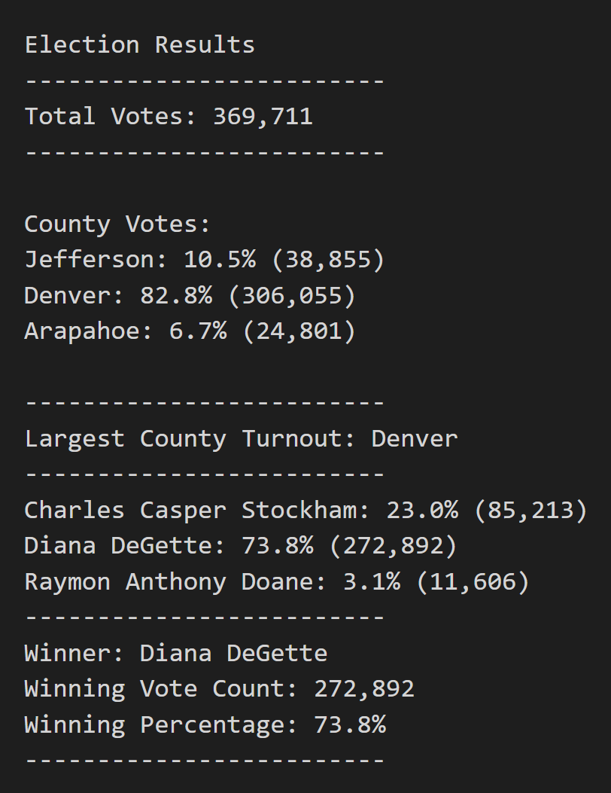

# Election Analysis
## Project Overview
For this project, the client was a Colorado Board of Elections employee. The client requested that an election audit be performed on a recent local congressional election. To complete the audit, the following tasks were carried out:

1. Calculate the total number of votes cast. 
2. Get a complete list of candidates who recieved votes. 
3. Calculate the total number of votes each candidate recieved. 
4. Calculate the percentage of votes each candidate won. 
5. Determine the winnder of the election based on popular vote. 
6. Get a complete list of counties that the votes originated from. 
7. Calculate the voter turnout for each county. 
8. Calculate the percentage of votes from each county. 
9. Determine the county with the highest turnout. 

## Resources
- Data Source: election_results.csvs
- Software: Python 3.7.6, Visual Studio Code 1.61.2

## Summary
The analysis of the election shows that:

- There were 369,711 votes cast in the election. 
- The candidates were
    - Charles Casper Stockham
    - Diana DeGette
    - Raymon Anthony Doane
- The candidate results were:
    - Charles Casper Stockham received 23.0% of the vote, for a total of 85,213 votes.
    - Diana DeGette received 73.8% of the vote, for a total of 272,892 votes. 
    - Raymon Anthony Doane who received 3.1% of the vote, for a total of 11,606 votes.
- The winner of the election was:
    - Diana DeGette, who received 73.8% of the vote, for a total of 272,892 votes. 
- The voter turnout for each county was:
    - Jefferson produced 10.5% of voters, for a total of 38,855 voters. 
    - Denver produced 82.8% of voters, for a total of 306,055 voters.
    - Arapahoe produced 6.7% of voters, for a total of 24,801 voters. 
- The county with the larges turnout was:
    - Denver, which produced 82.8% of voters, for a total of 306,055 voters. 

***Election Results Summary Table***

## Election Audit Summary
As one can see, with a simple modification of the original script, the election commission can now obtain voter turnout by county in addition to the candidate results. This additional data can help the commission allocate extra resources where voter turnout is low, and therefore improve election performance in future years.  

The modification of the script done for the current project is only scratching the surface of the analysis possibilities. For example, with the addition of a few lines of code the commission could further breakdown the county results to determine the percentage of votes for each candidate within each county. This modification would include supplementing the code with additional decision statements. For another possibility, if the commission wanted a more detailed look at a single county, the same script could be run by substituting county with city. 

To conclude, regardless of the scope of the data availables, the script written for this project can be a valuable asset for the commission as it can provide on-demand analysis. 